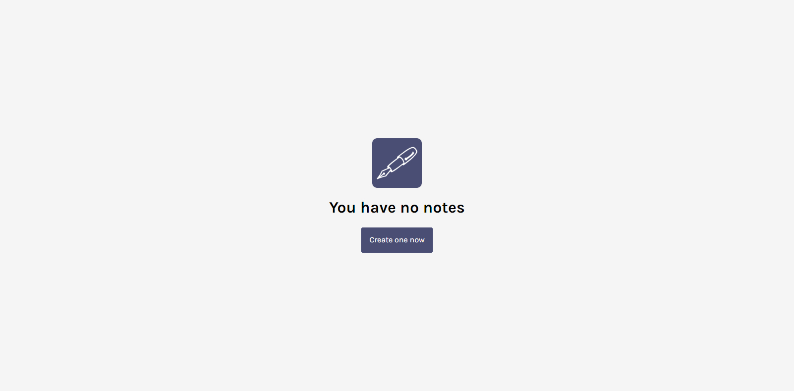
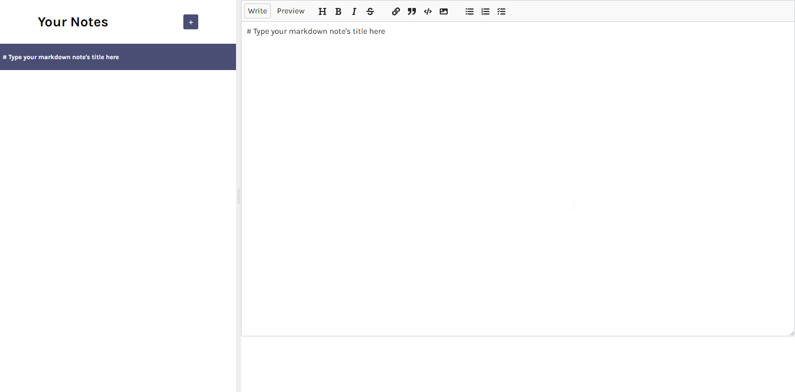

# Inkwell Notetaking App 
Welcome to the Inkwell repository! 

## Objective
This project is a no-login note taking app built with ReactJS to demonstrate use of Event Listeners in React, React State, Conditional Rendering in React, React Hooks(useEffect), Lazy state initialization, etc.

## Features
- sync changes to local storage
- note summary titles
- sorted by last modified
- delete

## Screenshots



## Installation
To get started, you'll need to have Node.js and npm (Node Package Manager) installed on your computer.

- Clone this repository to your local machine using git clone  
- Navigate to the cloned directory using cd 
- Run ```npm install``` to install the dependencies
- Run ```npm run dev``` to start the development server and visit http://localhost:3000 to view the app in your browser

## Todo - features and optimizations
- Allow note sharing
- Add timestamp to note

## Contributing
Please feel free to fork this repository and submit pull requests with any improvements or suggestions you may have.
